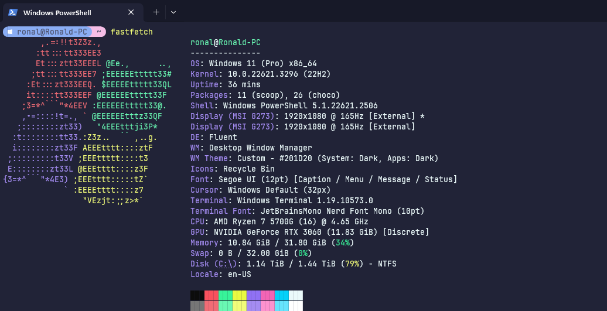

<!-- DO NOT CHANGE THIS -->
<p align="center">

</p>
<p>
Eldritch is a community-driven dark theme inspired by Lovecraftian horror. With tones from the dark abyss and an emphasis on green and blue, it caters to those who appreciate the darker side of life.
</p>

Main Theme repo can be found [here](https://github.com/eldritch-theme/eldritch)

## Showcase
<!-- Your screenshot should go here -->
<br/>

## Installation
1. Launch Windows Terminal.
2. Open the Settings panel or press `CTRL + ,`.
3. Select Open JSON file at bottom left corner or press `CTRL + SHIFT + ,`.
4. Copy the contents of `eldritch-scheme.json` into the opened config file under `schemes`.
Example:
```json
"schemes":
[
  {
    .. other colors and schemes
  },
  {
    .. eldritch theme
  }
],
```
5. Copy the contents of `eldritch-theme.json` into the config file under `themes`.
Example:
```json
"themes":
[
  {
    .. other themes
  },
  {
    .. eldritch theme
  }
],
```
6. Save the file, then exit.
7. Open the Settings panel or press `CTRL + ,`.
8. Go to Appearance.
9. Change `Application Theme` to `Eldritch`.
10. In the settings panel, under profiles, select the profile you want to apply the scheme to.
11. Go to Appearance, then change `Color Scheme` to `Eldritch`.
